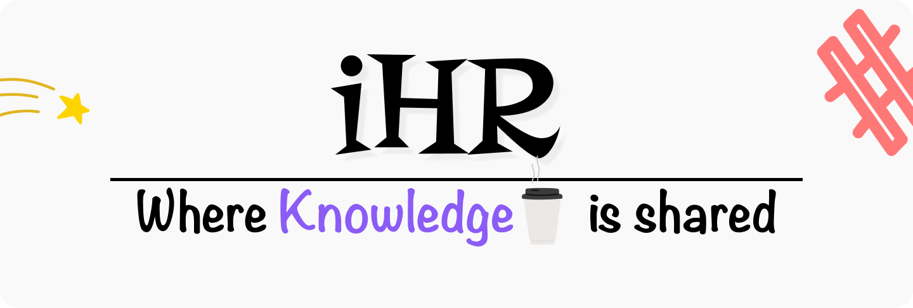

<h1>iHateReading Examples Repository</h1>

<h3>Purpose</h3>

This repository consists of all the programming based logs

<h3>Documentation</h3>
<ul>
  <li><a href="https://github.com/shreyvijayvargiya/iHateReadingLogs/tree/main/TechLogs">TechLogs<a>:Code concerning Frontend can be found inside it</li>
  <li><a href="https://github.com/shreyvijayvargiya/iHateReadingLogs/tree/main/TechLogsMobile">TechMobile<a>: Code concerning to Mobile application development can be find inside it</li>
    <li><a href="https://github.com/shreyvijayvargiya/iHateReadingLogs/tree/main/TechLogsBackend">TechLogsBackend<a>: Code concerning to Backend development can be found inside it</li>
</ul>

<h3>References</h3>
<ul>
  <li>To Read visit: <a href="https://www.ihatereading.in/logs">Logs</a></li>
  <li>To Download repositories: <a href="https://www.ihatereading.in/repos">Repos</a></li>
  <li>To View Projects visit: <a href="https://www.ihatereading.in/projects">Projects</a></li>
</ul>

<h3>Tech Stack</h3>
<li>Next JS</li>
<li>React</li>
<li>Material UI</li>
<li>Tailwind CSS</li>
<li>Node JS</li>
<li>Express</li>
<li>Redux</li>
<li>Styled-components</li>
<li>Bulma CSS</li>
<li>JSON Server</li>
<li>Firebase</li>

<h3>Support</h3>

We are bootstrapped startup and so far we have recieved decent traffic on our website. We are constantly growing, updating and your support 
  will definately matters a lot
 

Feel free to support us 

  

    
<h3>About Author</h3>

Hello I am <a href="https://shreyvijayvargiya26.medium.com/">Shrey Vijayvargiya</a>, I am Developer by profession because creating interfaces is my passion, 
    a Designer by interest as I love ommiting my thoughts using Figma &  a Journalist by blood because I constantly share my knowledge and indulge in writing journals for my audiences

