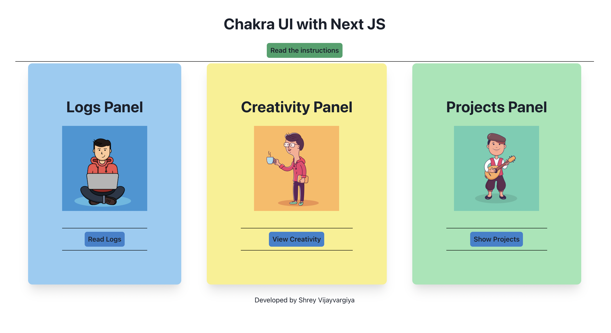

<h1>Next JS with Chakra UI</h1>

<h3>Purpose</h3>
<p>This repository explains installation of Chakra UI in Next JS </p>

<h3>Demo</h3>


<h3>References</h3>
<p>Read the article for better understanding</p>

<a href="https://shreyvijayvargiya26.medium.com/next-js-with-chakra-ui-testing-the-claims-of-being-the-best-ui-library-fe4bec82c4cd">Read Article</a>
  
 <h3>How to run</h3>
 
 ```
  $ git clone
  $ yarn
  $ yarn run dev
  $ open localhost:300
  
 ```

<h3>About Author</h3>
<p>Hello, I am <a href="https://shreyvijayvargiya26.medium.com/">Shrey Vijayvargiya</a>, I am a Developer by profession because creating interfaces is my passion. 
  <br /> a Designer by interest because I love omiting my thoughts using Figma & <br />a Journalist by blood because I constantly share my knowledge and indulge in writing journals for my audiences</p>
