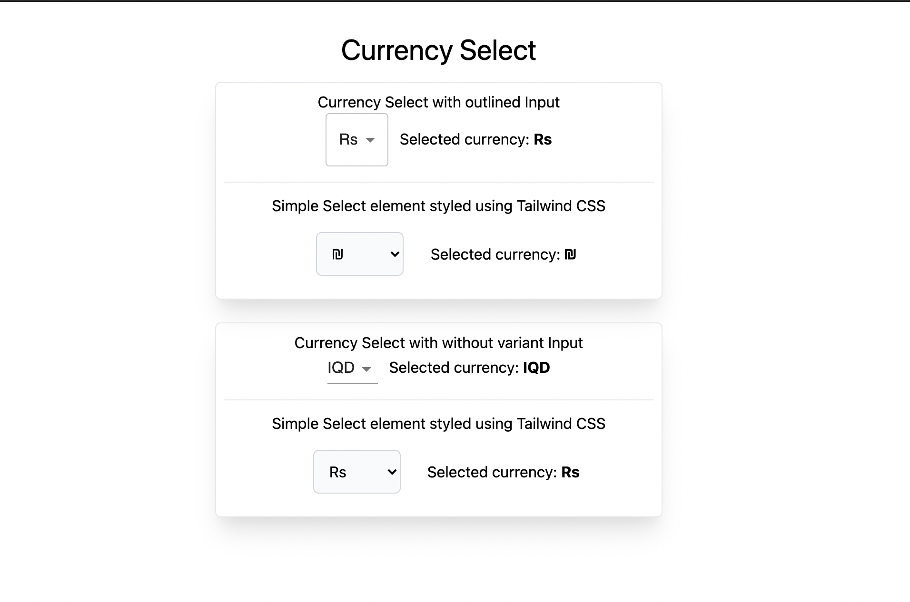

<h1>Creating Currency Select using single JSON object</h1>

<h3>Purpose</h3>
<p>This repo gives demo of creating the select currency dropdown using a single currencies JSON object
</p>

<h3>Demo</h3>


<h3>References</h3>
<p>Read the article for better understanding</p>

<a href="https://shreyvijayvargiya26.medium.com/one-json-object-for-developing-the-complete-currency-select-b6da93dacc4e">Read Article</a>

<h3>How to run</h3>
 
 ```
  $ git clone
  $ yarn
  $ yarn run dev
  $ open localhost:300
 ```

<h3>About Author</h3>
<p>Hello I am <a href="https://shreyvijayvargiya26.medium.com/">Shrey Vijayvargiya</a>, I am Developer by profession because creating interfaces is my passion. 
<br /> a Designer by interest because I love ommiting my thoughts using Figma & <br />a Journalist by blood because I constantly share my knowledge and indulge in writing journals for my audiences</p>
