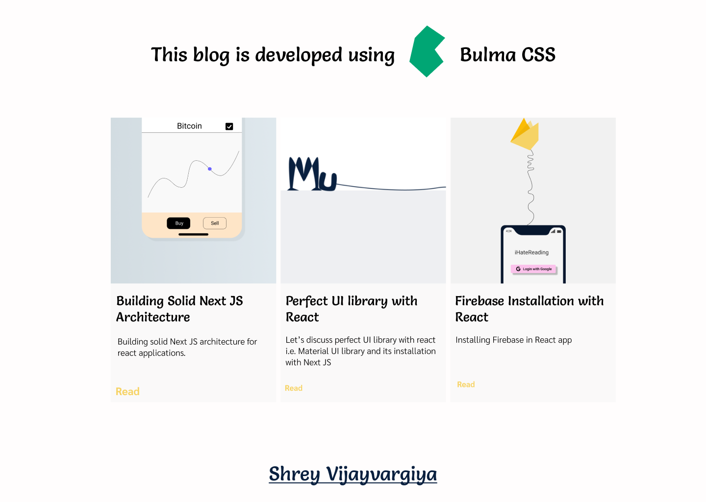

<h1>Installing Bulma CSS in Next JS</h1>

<h3>Demo Lookup</h3>


<h3>Purpose</h3>
<p>This repository gives the application of Bulma CSS with Next JS</p>

<h3>How to run</h3>

```
$ git clone
$ yarn
$ yarn run dev
$ open localhost:3000

```

<h3>Reference</h3>
<a href="https://shreyvijayvargiya26.medium.com/this-library-makes-css-a-cakewalk-471521a27d5a">Read the article</a>


<h3>About Author</h3>
<p>Hello I am <a href="https://shreyvijayvargiya26.medium.com/">Shrey Vijayvargiya</a>, I am Developer by profession because creating interfaces is my passion. 
  <br /> a Designer by interest because I love ommiting my thoughts using Figma & <br />a Journalist by blood because I constantly share my knowledge and indulge in writing journals for my audiences</p>
